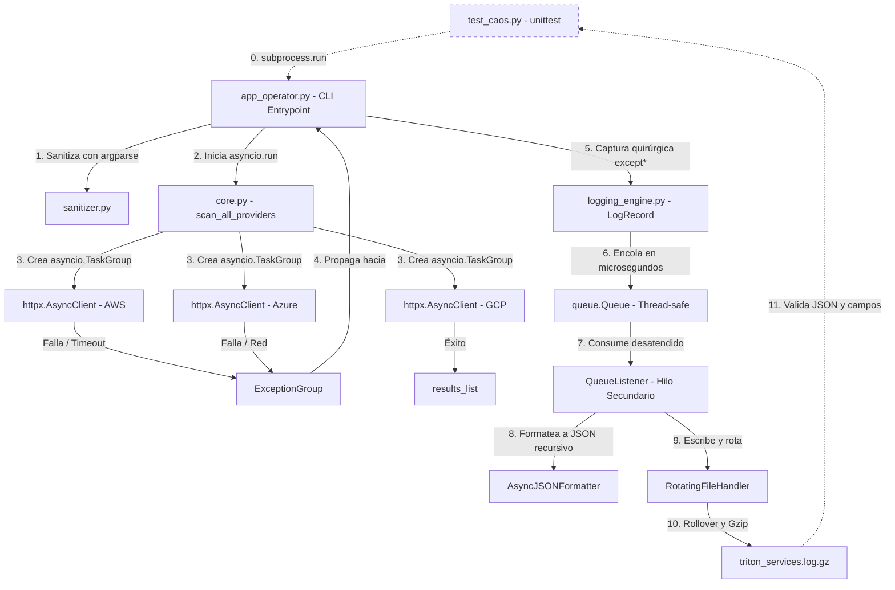

# 🚀 Proyecto Tritón - Monitor de Telemetría Multicloud

**Programación para Automatización II** — UPaTeCo

**Integrantes:**
- Marcela del Valle Tejerina
- Silva Augusto Tomas

---

## 1° Descripción del proyecto

El Proyecto Tritón consiste en desarrollar **TritonMonitor**, una herramienta de línea de comandos (CLI) destinada a monitorear el estado operativo de clústeres de cómputo ubicados simultáneamente en tres nubes distintas: **AWS**, **Azure** y **GCP**.

En lugar de utilizar simulaciones locales, el programa se conecta a APIs reales en internet de manera asíncrona (usando las librerías `httpx` y `asyncio`). Su objetivo principal es demostrar **resiliencia**: debe ser capaz de soportar caídas de red masivas, latencias extremas y fallos paralelos en las tres nubes sin cerrarse abruptamente, agrupando los errores y registrándolos en un archivo forense estructurado en formato JSON.

---

## 2° Arquitectura del proyecto

```
Proyecto triton/
│
├── README.md
├── requirements.txt
├── test_caos.py
├── triton_services.log
│
└── src/
    │
    ├── app_operator.py
    │
    └── triton_telemetry/
        │
        ├── __init__.py
        ├── core.py
        ├── exceptions.py
        ├── logging_engine.py
        └── sanitizer.py
```

---

## 3° Diagrama de arquitectura



---

## 4° Tecnologías usadas

| Tecnología | Descripción |
|---|---|
| **Python 3.11/3.12+** | Lenguaje base. Introduce `ExceptionGroup` nativos y la sintaxis `except*` para manejar fallos concurrentes. |
| **httpx (>=0.27.0)** | Cliente HTTP de alto rendimiento. Permite consultas asíncronas y no bloqueantes a APIs reales en internet. |
| **asyncio (TaskGroup)** | Biblioteca estándar para programación asíncrona. Orquesta de manera concurrente las peticiones a los proveedores cloud. |
| **argparse & re** | Validación declarativa y estricta en la CLI. `argparse` gestiona las entradas y `re` valida formatos como el ID de clúster. |
| **logging (QueueHandler & QueueListener)** | Motor de observabilidad. Pipeline de logging asíncrono y no bloqueante con cola segura en memoria e hilo secundario. |
| **json** | Formateador personalizado (`AsyncJSONFormatter`) que serializa logs y árboles recursivos de excepciones a formato JSON. |
| **gzip & shutil** | Compresión en caliente durante la rotación de archivos de log. Comprime a `.gz` y elimina el archivo plano residual. |

---

## 5° Instalación

### Navegar hasta la carpeta del proyecto

```bash
cd ruta/hacia/tu/carpeta/Proyecto triton
```

### Instalar las dependencias

```bash
pip install -r requirements.txt
```

---

## 6° Ejecución

La aplicación se ejecuta desde la raíz del proyecto.

### Ayuda de la interfaz CLI

```bash
python src/app_operator.py --help
```

### Escenario A — Operación Nominal

Para probar que todo funciona bien conectándose a AWS y GCP:

```bash
python src/app_operator.py AWS GCP -c cluster-us-east-01 -t 3.0
```

### Escenario B — Falla de Validación

Para probar que el sanitizer bloquea entradas incorrectas:

```bash
python src/app_operator.py AWS GCP -c cluster-invalido-id -t 9.5
```

### Escenario C — Inyección de Caos

Para probar la resiliencia del sistema ante fallos de red simulados:

```bash
python src/app_operator.py AWS Azure GCP -c cluster-us-west-02 -t 1.5 --chaos
```

### Ejecutar el test

```bash
python -m pytest test_caos.py -v
```

---

## 7° Conclusión

Proyecto Tritón es un ejercicio integral y avanzado de desarrollo de software moderno centrado en la infraestructura cloud. A través de la creación de la herramienta de consola **TritonMonitor**, el proyecto demuestra cómo construir un sistema capaz de soportar condiciones de red extremas.
